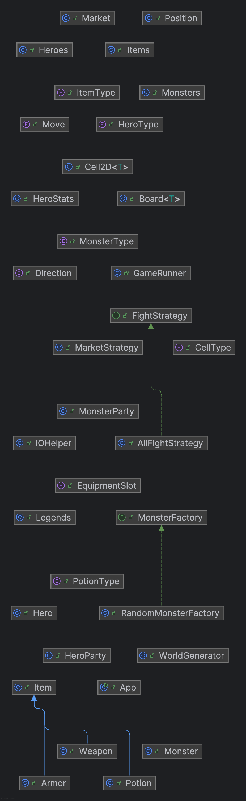

# CS611-Assignment <5>
## < Legends of Valor >
---------------------------------------------------------------------------
- Name: Sundeep Routhu
- Email: srouthu@bu.edu
- Student ID: U77551834

## Files
---------------------------------------------------------------------------

**App.java**                    - Main class which runs the program

**GameRunner.java**             - Class which selects the game and plays it \
\
**Board.java**                  - 2D board of size n x m containing generic cells. For the games implemented, the cells are Heroes, Market and Walls.\
**Cell2D.java**                 - A generic cell in a 2D Board\
**Position.java**               - Represents a position in the 2D board\
**Position.java**               - Represents a direction\
\
**Item.java**                   - Represents an item being sold in the market\
**Items.java**                  - All items in the market\
**ItemType.java**               - Type of Item\
**Weapon.java**                 - Item which is a weapon\
**Armor.java**                  - Item which is an armor\
**Potion.java**                 - Item which is a poiton\
**PotionType.java**             - Type of potion\
\
**Living.java**                 - Represents a living object\
**Hero.java**                   - Represents a singular hero\
**Heros.java**                  - All heroes\
**HeroParty.java**              - A party of heroes\
**HeroStats.java**              - Stats of the hero, like hp, mp etc.\
**HeroType.java**               - The type of hero\
**EquipmentSlot.java**          - Slots in which a hero can hold an item\
\
**Monster.java**                - Represents a singular monster \
**Monsters.java**               - All monsters \
**MonsterParty.java**           - A party of monsters\
**MonsterType.java**            - The type of monster\
**MonsterFactory.java**         - Generates monsters\
**RandomMonsterFactory.java**   - Generates random monsters on the lane\

**Lane.java**                   - Represents a single lane in the game\
**Market.java**                 - A place to buy items\
**SpellEffect.java**            - A spell effect\
**TerrainEffect.java**          - A terrain effect\
\
**IOHelper.java**               - A utility class to print in console\
\
**WorldGenerator.java**         - Generates the world, heroes and market\
**RPGGame.java**                - Plays a RPG Game\
**Legends.java**                - The core central loop controlling the game\

## Notes
---------------------------------------------------------------------------

### Features / Design Document
- Able to see the instructions before the game starts
- Able to select three heroes, one for each lane
- Heroes status will be displayed before their turn
- Heroes moves will be displayed before their turn
    - Can move the heroes with "w/a/s/d" 
    - Can attack the monster if on the same or adjacent tile
    - Can cast a spell
    - Can teleport to another targets
    - Can recall to nexus
    - Can use an item
    - Can buy items from the market
    - Can quit the game
- Market provides various items which the heroes can buy and equip
- Heroes can sell tems if they are on the market
- Monsters are generated after every 8th turn
- Heroes can fight the monsters if they are adjacent
- There are three types of terrains(bush,cave,koulou) and each have their own effect
- Heroes cannot cross to another lane without teleporting
- Heroes can be recalled to the nexus
- Game ends when the opponent reaches the others nexus
- Heroes can select the monster they want to fight with, for now there is only 1 monster in the group
- Have a fixed set of heroes, items, monsters
- The whole map can be seen when a hero moves
    - Heroes are shows as H1,H2,H3
    - Monsters are shown as M1,M2,M3
    - Obstacles are shown as XXXX
    - Terrain types are marked with B for Bush, K for Koulou, C for Cave,
- Console output is colored(only in terminals which support ANSI escape codes)
    - Errors are in red
    - Prompts are in yellow
    - Output is in green
- Console rings a bell when the input is invalid(supported in only few terminals)

### Design Decisions
- **Item.java** is an abstract class and other items like weapons, armors extend an item.
- Factories are used at multiple places, like generating the world etc.
- *Composition over inheritance* is utilized at a few places.
- *Separation of concerns* is important so each responsibily is encapsulated by different components like Hero, Party, Item etc. Even IO operations are handled in its own class.


## How to compile and run
---------------------------------------------------------------------------
Directions on how to run the code.
```
javac App.java && java App
```

## UML
---------------------------------------------------------------------------



## Input/Output Example
---------------------------------------------------------------------------
```
╔══════════════════════════════════════════╗
║           Legends of Valor               ║
║    A MOBA-style Heroes vs Monsters Game  ║
╚══════════════════════════════════════════╝

Welcome to Legends of Valor!
Get ready to battle in this MOBA-style adventure.

Press Enter to continue...
[+] 
>> 

=== Welcome to Legends of Valor ===
A MOBA-style game where heroes battle monsters!

1. Start New Game
2. Show Instructions
3. Quit
[+] Enter your choice (1-3): 
>> 1

Select 3 heroes for your team:

Available Heroes:
----------------
Gaerdal Ironhand     | Type: WARRIOR    | Level: 1
Sehanine Monnbow     | Type: WARRIOR    | Level: 1
Muamman Duathall     | Type: WARRIOR    | Level: 1
Flandal Steelskin    | Type: WARRIOR    | Level: 1
Undefeated Yoj       | Type: WARRIOR    | Level: 1
Eunoia Cyn           | Type: WARRIOR    | Level: 1
Rillifane Rallathil  | Type: SORCEROR   | Level: 1
Segojan Earthcaller  | Type: SORCEROR   | Level: 1
Reign Havoc          | Type: SORCEROR   | Level: 1
Reverie Ashels       | Type: SORCEROR   | Level: 1
Kalabar              | Type: SORCEROR   | Level: 1
Parzival             | Type: PALADIN    | Level: 1
Sehanine Moonbow     | Type: PALADIN    | Level: 1
Skoraeus Stonebones  | Type: PALADIN    | Level: 1

[+] Select hero for lane 1: 
>> Kalabar

Available Heroes:
----------------
Gaerdal Ironhand     | Type: WARRIOR    | Level: 1
Sehanine Monnbow     | Type: WARRIOR    | Level: 1
Muamman Duathall     | Type: WARRIOR    | Level: 1
Flandal Steelskin    | Type: WARRIOR    | Level: 1
Undefeated Yoj       | Type: WARRIOR    | Level: 1
Eunoia Cyn           | Type: WARRIOR    | Level: 1
Rillifane Rallathil  | Type: SORCEROR   | Level: 1
Segojan Earthcaller  | Type: SORCEROR   | Level: 1
Reign Havoc          | Type: SORCEROR   | Level: 1
Reverie Ashels       | Type: SORCEROR   | Level: 1
Kalabar              | Type: SORCEROR   | Level: 1
Parzival             | Type: PALADIN    | Level: 1
Sehanine Moonbow     | Type: PALADIN    | Level: 1
Skoraeus Stonebones  | Type: PALADIN    | Level: 1

[+] Select hero for lane 2: 
>> Skoraeus Stonebones

Available Heroes:
----------------
Gaerdal Ironhand     | Type: WARRIOR    | Level: 1
Sehanine Monnbow     | Type: WARRIOR    | Level: 1
Muamman Duathall     | Type: WARRIOR    | Level: 1
Flandal Steelskin    | Type: WARRIOR    | Level: 1
Undefeated Yoj       | Type: WARRIOR    | Level: 1
Eunoia Cyn           | Type: WARRIOR    | Level: 1
Rillifane Rallathil  | Type: SORCEROR   | Level: 1
Segojan Earthcaller  | Type: SORCEROR   | Level: 1
Reign Havoc          | Type: SORCEROR   | Level: 1
Reverie Ashels       | Type: SORCEROR   | Level: 1
Kalabar              | Type: SORCEROR   | Level: 1
Parzival             | Type: PALADIN    | Level: 1
Sehanine Moonbow     | Type: PALADIN    | Level: 1
Skoraeus Stonebones  | Type: PALADIN    | Level: 1

[+] Select hero for lane 3: 
>> Reign Havoc 
Invalid hero name
[+] Select hero for lane 3: 
>> Reign Havoc 
Welcome to Legends of Valor!
-----------------------------
Reach the monster's nexus to win!
Don't let monsters reach your nexus!

Controls:
W/A/S/D - Move
T - Teleport
R - Recall
I - Use Item
M - Market (at Nexus only)
Spawned Natsunomeryu (Level 1) in lane 1
Spawned BigBad-Wolf (Level 1) in lane 2
Spawned Chrysophylax (Level 1) in lane 3

=== Round 1 ===
    0       1       2       3       4       5       6       7       
N - N - N  N - N - N  I - I - I  N - N - N  N - N - N  I - I - I  N - N - N  N - N - N  
 | M1     |         |  X X X X  | M2     |         |  X X X X  | M3     |         |
N - N - N  N - N - N  I - I - I  N - N - N  N - N - N  I - I - I  N - N - N  N - N - N  

K - K - K  P - P - P  I - I - I  B - B - B  B - B - B  I - I - I  K - K - K  K - K - K  
 |         |         |  X X X X  |         |         |  X X X X  |         |         |
K - K - K  P - P - P  I - I - I  B - B - B  B - B - B  I - I - I  K - K - K  K - K - K  

K - K - K  C - C - C  I - I - I  C - C - C  K - K - K  I - I - I  C - C - C  K - K - K  
 |         |         |  X X X X  |         |         |  X X X X  |         |         |
K - K - K  C - C - C  I - I - I  C - C - C  K - K - K  I - I - I  C - C - C  K - K - K  

P - P - P  B - B - B  I - I - I  K - K - K  B - B - B  I - I - I  B - B - B  P - P - P  
 |         |         |  X X X X  |         |         |  X X X X  |         |         |
P - P - P  B - B - B  I - I - I  K - K - K  B - B - B  I - I - I  B - B - B  P - P - P  

K - K - K  C - C - C  I - I - I  P - P - P  C - C - C  I - I - I  K - K - K  C - C - C  
 |         |         |  X X X X  |         |         |  X X X X  |         |         |
K - K - K  C - C - C  I - I - I  P - P - P  C - C - C  I - I - I  K - K - K  C - C - C  

B - B - B  C - C - C  I - I - I  K - K - K  C - C - C  I - I - I  C - C - C  C - C - C  
 |         |         |  X X X X  |         |         |  X X X X  |         |         |
B - B - B  C - C - C  I - I - I  K - K - K  C - C - C  I - I - I  C - C - C  C - C - C  

B - B - B  B - B - B  I - I - I  P - P - P  P - P - P  I - I - I  B - B - B  C - C - C  
 |         |         |  X X X X  |         |         |  X X X X  |         |         |
B - B - B  B - B - B  I - I - I  P - P - P  P - P - P  I - I - I  B - B - B  C - C - C  

N - N - N  N - N - N  I - I - I  N - N - N  N - N - N  I - I - I  N - N - N  N - N - N  
 | H1     |         |  X X X X  | H2     |         |  X X X X  | H3     |         |
N - N - N  N - N - N  I - I - I  N - N - N  N - N - N  I - I - I  N - N - N  N - N - N  

=== Heroes' Turn ===

=== Skoraeus Stonebones's Status ===
HP: 100.0/100.0
MP: 250.0/250.0
Position: (7,3)
Current Space: NEXUS
[+] Choose action:
1. Move (W/A/S/D)
2. Attack
3. Cast Spell
4. Teleport
5. Recall
6. Use Item
7. Market (only in Nexus)
Q. Quit
Choice: 
>> 4

Possible teleport targets:
1. Kalabar at (7,0)
2. Reign Havoc at (7,6)
[+] Choose hero to teleport to (1-2): 
>> 1
[+] Choose action:
1. Move (W/A/S/D)
2. Attack
3. Cast Spell
4. Teleport
5. Recall
6. Use Item
7. Market (only in Nexus)
Q. Quit
Choice: 
>> 1
[+] [+] Enter direction (W/A/S/D): 
>> W
Skoraeus Stonebones moved W
    0       1       2       3       4       5       6       7       
N - N - N  N - N - N  I - I - I  N - N - N  N - N - N  I - I - I  N - N - N  N - N - N  
 | M1     |         |  X X X X  | M2     |         |  X X X X  | M3     |         |
N - N - N  N - N - N  I - I - I  N - N - N  N - N - N  I - I - I  N - N - N  N - N - N  

K - K - K  P - P - P  I - I - I  B - B - B  B - B - B  I - I - I  K - K - K  K - K - K  
 |         |         |  X X X X  |         |         |  X X X X  |         |         |
K - K - K  P - P - P  I - I - I  B - B - B  B - B - B  I - I - I  K - K - K  K - K - K  

K - K - K  C - C - C  I - I - I  C - C - C  K - K - K  I - I - I  C - C - C  K - K - K  
 |         |         |  X X X X  |         |         |  X X X X  |         |         |
K - K - K  C - C - C  I - I - I  C - C - C  K - K - K  I - I - I  C - C - C  K - K - K  

P - P - P  B - B - B  I - I - I  K - K - K  B - B - B  I - I - I  B - B - B  P - P - P  
 |         |         |  X X X X  |         |         |  X X X X  |         |         |
P - P - P  B - B - B  I - I - I  K - K - K  B - B - B  I - I - I  B - B - B  P - P - P  

K - K - K  C - C - C  I - I - I  P - P - P  C - C - C  I - I - I  K - K - K  C - C - C  
 |         |         |  X X X X  |         |         |  X X X X  |         |         |
K - K - K  C - C - C  I - I - I  P - P - P  C - C - C  I - I - I  K - K - K  C - C - C  

B - B - B  C - C - C  I - I - I  K - K - K  C - C - C  I - I - I  C - C - C  C - C - C  
 |         |         |  X X X X  |         |         |  X X X X  |         |         |
B - B - B  C - C - C  I - I - I  K - K - K  C - C - C  I - I - I  C - C - C  C - C - C  

B - B - B  B - B - B  I - I - I  P - P - P  P - P - P  I - I - I  B - B - B  C - C - C  
 |         |         |  X X X X  | H2     |         |  X X X X  |         |         |
B - B - B  B - B - B  I - I - I  P - P - P  P - P - P  I - I - I  B - B - B  C - C - C  

N - N - N  N - N - N  I - I - I  N - N - N  N - N - N  I - I - I  N - N - N  N - N - N  
 | H1     |         |  X X X X  |         |         |  X X X X  | H3     |         |
N - N - N  N - N - N  I - I - I  N - N - N  N - N - N  I - I - I  N - N - N  N - N - N  

=== Kalabar's Status ===
HP: 100.0/100.0
MP: 800.0/800.0
Position: (7,0)
Current Space: NEXUS
[+] Choose action:
1. Move (W/A/S/D)
2. Attack
3. Cast Spell
4. Teleport
5. Recall
6. Use Item
7. Market (only in Nexus)
Q. Quit
Choice: 
>> 7
[+] Market Options:
1. Buy
2. Sell
3. Exit
Choice: 
>> 3

=== Reign Havoc's Status ===
HP: 100.0/100.0
MP: 800.0/800.0
Position: (7,6)
Current Space: NEXUS
[+] Choose action:
1. Move (W/A/S/D)
2. Attack
3. Cast Spell
4. Teleport
5. Recall
6. Use Item
7. Market (only in Nexus)
Q. Quit
Choice: 
>> 1
[+] [+] Enter direction (W/A/S/D): 
>> W
Reign Havoc moved W
    0       1       2       3       4       5       6       7       
N - N - N  N - N - N  I - I - I  N - N - N  N - N - N  I - I - I  N - N - N  N - N - N  
 | M1     |         |  X X X X  | M2     |         |  X X X X  | M3     |         |
N - N - N  N - N - N  I - I - I  N - N - N  N - N - N  I - I - I  N - N - N  N - N - N  

K - K - K  P - P - P  I - I - I  B - B - B  B - B - B  I - I - I  K - K - K  K - K - K  
 |         |         |  X X X X  |         |         |  X X X X  |         |         |
K - K - K  P - P - P  I - I - I  B - B - B  B - B - B  I - I - I  K - K - K  K - K - K  

K - K - K  C - C - C  I - I - I  C - C - C  K - K - K  I - I - I  C - C - C  K - K - K  
 |         |         |  X X X X  |         |         |  X X X X  |         |         |
K - K - K  C - C - C  I - I - I  C - C - C  K - K - K  I - I - I  C - C - C  K - K - K  

P - P - P  B - B - B  I - I - I  K - K - K  B - B - B  I - I - I  B - B - B  P - P - P  
 |         |         |  X X X X  |         |         |  X X X X  |         |         |
P - P - P  B - B - B  I - I - I  K - K - K  B - B - B  I - I - I  B - B - B  P - P - P  

K - K - K  C - C - C  I - I - I  P - P - P  C - C - C  I - I - I  K - K - K  C - C - C  
 |         |         |  X X X X  |         |         |  X X X X  |         |         |
K - K - K  C - C - C  I - I - I  P - P - P  C - C - C  I - I - I  K - K - K  C - C - C  

B - B - B  C - C - C  I - I - I  K - K - K  C - C - C  I - I - I  C - C - C  C - C - C  
 |         |         |  X X X X  |         |         |  X X X X  |         |         |
B - B - B  C - C - C  I - I - I  K - K - K  C - C - C  I - I - I  C - C - C  C - C - C  

B - B - B  B - B - B  I - I - I  P - P - P  P - P - P  I - I - I  B - B - B  C - C - C  
 |         |         |  X X X X  | H2     |         |  X X X X  | H3     |         |
B - B - B  B - B - B  I - I - I  P - P - P  P - P - P  I - I - I  B - B - B  C - C - C  

N - N - N  N - N - N  I - I - I  N - N - N  N - N - N  I - I - I  N - N - N  N - N - N  
 | H1     |         |  X X X X  |         |         |  X X X X  |         |         |
N - N - N  N - N - N  I - I - I  N - N - N  N - N - N  I - I - I  N - N - N  N - N - N  

=== Monsters' Turn ===
Chrysophylax moves forward!
BigBad-Wolf moves forward!
Natsunomeryu moves forward!

=== Round 2 ===
    0       1       2       3       4       5       6       7       
N - N - N  N - N - N  I - I - I  N - N - N  N - N - N  I - I - I  N - N - N  N - N - N  
 |         |         |  X X X X  |         |         |  X X X X  |         |         |
N - N - N  N - N - N  I - I - I  N - N - N  N - N - N  I - I - I  N - N - N  N - N - N  

K - K - K  P - P - P  I - I - I  B - B - B  B - B - B  I - I - I  K - K - K  K - K - K  
 | M1     |         |  X X X X  | M2     |         |  X X X X  | M3     |         |
K - K - K  P - P - P  I - I - I  B - B - B  B - B - B  I - I - I  K - K - K  K - K - K  

K - K - K  C - C - C  I - I - I  C - C - C  K - K - K  I - I - I  C - C - C  K - K - K  
 |         |         |  X X X X  |         |         |  X X X X  |         |         |
K - K - K  C - C - C  I - I - I  C - C - C  K - K - K  I - I - I  C - C - C  K - K - K  

P - P - P  B - B - B  I - I - I  K - K - K  B - B - B  I - I - I  B - B - B  P - P - P  
 |         |         |  X X X X  |         |         |  X X X X  |         |         |
P - P - P  B - B - B  I - I - I  K - K - K  B - B - B  I - I - I  B - B - B  P - P - P  

K - K - K  C - C - C  I - I - I  P - P - P  C - C - C  I - I - I  K - K - K  C - C - C  
 |         |         |  X X X X  |         |         |  X X X X  |         |         |
K - K - K  C - C - C  I - I - I  P - P - P  C - C - C  I - I - I  K - K - K  C - C - C  

B - B - B  C - C - C  I - I - I  K - K - K  C - C - C  I - I - I  C - C - C  C - C - C  
 |         |         |  X X X X  |         |         |  X X X X  |         |         |
B - B - B  C - C - C  I - I - I  K - K - K  C - C - C  I - I - I  C - C - C  C - C - C  

B - B - B  B - B - B  I - I - I  P - P - P  P - P - P  I - I - I  B - B - B  C - C - C  
 |         |         |  X X X X  | H2     |         |  X X X X  | H3     |         |
B - B - B  B - B - B  I - I - I  P - P - P  P - P - P  I - I - I  B - B - B  C - C - C  

N - N - N  N - N - N  I - I - I  N - N - N  N - N - N  I - I - I  N - N - N  N - N - N  
 | H1     |         |  X X X X  |         |         |  X X X X  |         |         |
N - N - N  N - N - N  I - I - I  N - N - N  N - N - N  I - I - I  N - N - N  N - N - N  

=== Heroes' Turn ===

=== Skoraeus Stonebones's Status ===
HP: 100.0/100.0
MP: 250.0/250.0
Position: (6,3)
Current Space: PLAIN
[+] Choose action:
1. Move (W/A/S/D)
2. Attack
3. Cast Spell
4. Teleport
5. Recall
6. Use Item
7. Market (only in Nexus)
Q. Quit
Choice: 
>> 1
[+] [+] Enter direction (W/A/S/D): 
>> W
Skoraeus Stonebones moved W
    0       1       2       3       4       5       6       7       
N - N - N  N - N - N  I - I - I  N - N - N  N - N - N  I - I - I  N - N - N  N - N - N  
 |         |         |  X X X X  |         |         |  X X X X  |         |         |
N - N - N  N - N - N  I - I - I  N - N - N  N - N - N  I - I - I  N - N - N  N - N - N  

K - K - K  P - P - P  I - I - I  B - B - B  B - B - B  I - I - I  K - K - K  K - K - K  
 | M1     |         |  X X X X  | M2     |         |  X X X X  | M3     |         |
K - K - K  P - P - P  I - I - I  B - B - B  B - B - B  I - I - I  K - K - K  K - K - K  

K - K - K  C - C - C  I - I - I  C - C - C  K - K - K  I - I - I  C - C - C  K - K - K  
 |         |         |  X X X X  |         |         |  X X X X  |         |         |
K - K - K  C - C - C  I - I - I  C - C - C  K - K - K  I - I - I  C - C - C  K - K - K  

P - P - P  B - B - B  I - I - I  K - K - K  B - B - B  I - I - I  B - B - B  P - P - P  
 |         |         |  X X X X  |         |         |  X X X X  |         |         |
P - P - P  B - B - B  I - I - I  K - K - K  B - B - B  I - I - I  B - B - B  P - P - P  

K - K - K  C - C - C  I - I - I  P - P - P  C - C - C  I - I - I  K - K - K  C - C - C  
 |         |         |  X X X X  |         |         |  X X X X  |         |         |
K - K - K  C - C - C  I - I - I  P - P - P  C - C - C  I - I - I  K - K - K  C - C - C  

B - B - B  C - C - C  I - I - I  K - K - K  C - C - C  I - I - I  C - C - C  C - C - C  
 |         |         |  X X X X  | H2     |         |  X X X X  |         |         |
B - B - B  C - C - C  I - I - I  K - K - K  C - C - C  I - I - I  C - C - C  C - C - C  

B - B - B  B - B - B  I - I - I  P - P - P  P - P - P  I - I - I  B - B - B  C - C - C  
 |         |         |  X X X X  |         |         |  X X X X  | H3     |         |
B - B - B  B - B - B  I - I - I  P - P - P  P - P - P  I - I - I  B - B - B  C - C - C  

N - N - N  N - N - N  I - I - I  N - N - N  N - N - N  I - I - I  N - N - N  N - N - N  
 | H1     |         |  X X X X  |         |         |  X X X X  |         |         |
N - N - N  N - N - N  I - I - I  N - N - N  N - N - N  I - I - I  N - N - N  N - N - N  

=== Kalabar's Status ===
HP: 100.0/100.0
MP: 800.0/800.0
Position: (7,0)
Current Space: NEXUS
[+] Choose action:
1. Move (W/A/S/D)
2. Attack
3. Cast Spell
4. Teleport
5. Recall
6. Use Item
7. Market (only in Nexus)
Q. Quit
Choice: 
>> 1
[+] [+] Enter direction (W/A/S/D): 
>> W
Kalabar moved W
    0       1       2       3       4       5       6       7       
N - N - N  N - N - N  I - I - I  N - N - N  N - N - N  I - I - I  N - N - N  N - N - N  
 |         |         |  X X X X  |         |         |  X X X X  |         |         |
N - N - N  N - N - N  I - I - I  N - N - N  N - N - N  I - I - I  N - N - N  N - N - N  

K - K - K  P - P - P  I - I - I  B - B - B  B - B - B  I - I - I  K - K - K  K - K - K  
 | M1     |         |  X X X X  | M2     |         |  X X X X  | M3     |         |
K - K - K  P - P - P  I - I - I  B - B - B  B - B - B  I - I - I  K - K - K  K - K - K  

K - K - K  C - C - C  I - I - I  C - C - C  K - K - K  I - I - I  C - C - C  K - K - K  
 |         |         |  X X X X  |         |         |  X X X X  |         |         |
K - K - K  C - C - C  I - I - I  C - C - C  K - K - K  I - I - I  C - C - C  K - K - K  

P - P - P  B - B - B  I - I - I  K - K - K  B - B - B  I - I - I  B - B - B  P - P - P  
 |         |         |  X X X X  |         |         |  X X X X  |         |         |
P - P - P  B - B - B  I - I - I  K - K - K  B - B - B  I - I - I  B - B - B  P - P - P  

K - K - K  C - C - C  I - I - I  P - P - P  C - C - C  I - I - I  K - K - K  C - C - C  
 |         |         |  X X X X  |         |         |  X X X X  |         |         |
K - K - K  C - C - C  I - I - I  P - P - P  C - C - C  I - I - I  K - K - K  C - C - C  

B - B - B  C - C - C  I - I - I  K - K - K  C - C - C  I - I - I  C - C - C  C - C - C  
 |         |         |  X X X X  | H2     |         |  X X X X  |         |         |
B - B - B  C - C - C  I - I - I  K - K - K  C - C - C  I - I - I  C - C - C  C - C - C  

B - B - B  B - B - B  I - I - I  P - P - P  P - P - P  I - I - I  B - B - B  C - C - C  
 | H1     |         |  X X X X  |         |         |  X X X X  | H3     |         |
B - B - B  B - B - B  I - I - I  P - P - P  P - P - P  I - I - I  B - B - B  C - C - C  

N - N - N  N - N - N  I - I - I  N - N - N  N - N - N  I - I - I  N - N - N  N - N - N  
 |         |         |  X X X X  |         |         |  X X X X  |         |         |
N - N - N  N - N - N  I - I - I  N - N - N  N - N - N  I - I - I  N - N - N  N - N - N  

=== Reign Havoc's Status ===
HP: 100.0/100.0
MP: 800.0/800.0
Position: (6,6)
Current Space: BUSH
[+] Choose action:
1. Move (W/A/S/D)
2. Attack
3. Cast Spell
4. Teleport
5. Recall
6. Use Item
7. Market (only in Nexus)
Q. Quit
Choice: 
>> 1
[+] [+] Enter direction (W/A/S/D): 
>> W
Reign Havoc moved W
    0       1       2       3       4       5       6       7       
N - N - N  N - N - N  I - I - I  N - N - N  N - N - N  I - I - I  N - N - N  N - N - N  
 |         |         |  X X X X  |         |         |  X X X X  |         |         |
N - N - N  N - N - N  I - I - I  N - N - N  N - N - N  I - I - I  N - N - N  N - N - N  

K - K - K  P - P - P  I - I - I  B - B - B  B - B - B  I - I - I  K - K - K  K - K - K  
 | M1     |         |  X X X X  | M2     |         |  X X X X  | M3     |         |
K - K - K  P - P - P  I - I - I  B - B - B  B - B - B  I - I - I  K - K - K  K - K - K  

K - K - K  C - C - C  I - I - I  C - C - C  K - K - K  I - I - I  C - C - C  K - K - K  
 |         |         |  X X X X  |         |         |  X X X X  |         |         |
K - K - K  C - C - C  I - I - I  C - C - C  K - K - K  I - I - I  C - C - C  K - K - K  

P - P - P  B - B - B  I - I - I  K - K - K  B - B - B  I - I - I  B - B - B  P - P - P  
 |         |         |  X X X X  |         |         |  X X X X  |         |         |
P - P - P  B - B - B  I - I - I  K - K - K  B - B - B  I - I - I  B - B - B  P - P - P  

K - K - K  C - C - C  I - I - I  P - P - P  C - C - C  I - I - I  K - K - K  C - C - C  
 |         |         |  X X X X  |         |         |  X X X X  |         |         |
K - K - K  C - C - C  I - I - I  P - P - P  C - C - C  I - I - I  K - K - K  C - C - C  

B - B - B  C - C - C  I - I - I  K - K - K  C - C - C  I - I - I  C - C - C  C - C - C  
 |         |         |  X X X X  | H2     |         |  X X X X  | H3     |         |
B - B - B  C - C - C  I - I - I  K - K - K  C - C - C  I - I - I  C - C - C  C - C - C  

B - B - B  B - B - B  I - I - I  P - P - P  P - P - P  I - I - I  B - B - B  C - C - C  
 | H1     |         |  X X X X  |         |         |  X X X X  |         |         |
B - B - B  B - B - B  I - I - I  P - P - P  P - P - P  I - I - I  B - B - B  C - C - C  

N - N - N  N - N - N  I - I - I  N - N - N  N - N - N  I - I - I  N - N - N  N - N - N  
 |         |         |  X X X X  |         |         |  X X X X  |         |         |
N - N - N  N - N - N  I - I - I  N - N - N  N - N - N  I - I - I  N - N - N  N - N - N  

=== Monsters' Turn ===
Chrysophylax moves forward!
BigBad-Wolf moves forward!
Natsunomeryu moves forward!

=== Round 3 ===
    0       1       2       3       4       5       6       7       
N - N - N  N - N - N  I - I - I  N - N - N  N - N - N  I - I - I  N - N - N  N - N - N  
 |         |         |  X X X X  |         |         |  X X X X  |         |         |
N - N - N  N - N - N  I - I - I  N - N - N  N - N - N  I - I - I  N - N - N  N - N - N  

K - K - K  P - P - P  I - I - I  B - B - B  B - B - B  I - I - I  K - K - K  K - K - K  
 |         |         |  X X X X  |         |         |  X X X X  |         |         |
K - K - K  P - P - P  I - I - I  B - B - B  B - B - B  I - I - I  K - K - K  K - K - K  

K - K - K  C - C - C  I - I - I  C - C - C  K - K - K  I - I - I  C - C - C  K - K - K  
 | M1     |         |  X X X X  | M2     |         |  X X X X  | M3     |         |
K - K - K  C - C - C  I - I - I  C - C - C  K - K - K  I - I - I  C - C - C  K - K - K  

P - P - P  B - B - B  I - I - I  K - K - K  B - B - B  I - I - I  B - B - B  P - P - P  
 |         |         |  X X X X  |         |         |  X X X X  |         |         |
P - P - P  B - B - B  I - I - I  K - K - K  B - B - B  I - I - I  B - B - B  P - P - P  

K - K - K  C - C - C  I - I - I  P - P - P  C - C - C  I - I - I  K - K - K  C - C - C  
 |         |         |  X X X X  |         |         |  X X X X  |         |         |
K - K - K  C - C - C  I - I - I  P - P - P  C - C - C  I - I - I  K - K - K  C - C - C  

B - B - B  C - C - C  I - I - I  K - K - K  C - C - C  I - I - I  C - C - C  C - C - C  
 |         |         |  X X X X  | H2     |         |  X X X X  | H3     |         |
B - B - B  C - C - C  I - I - I  K - K - K  C - C - C  I - I - I  C - C - C  C - C - C  

B - B - B  B - B - B  I - I - I  P - P - P  P - P - P  I - I - I  B - B - B  C - C - C  
 | H1     |         |  X X X X  |         |         |  X X X X  |         |         |
B - B - B  B - B - B  I - I - I  P - P - P  P - P - P  I - I - I  B - B - B  C - C - C  

N - N - N  N - N - N  I - I - I  N - N - N  N - N - N  I - I - I  N - N - N  N - N - N  
 |         |         |  X X X X  |         |         |  X X X X  |         |         |
N - N - N  N - N - N  I - I - I  N - N - N  N - N - N  I - I - I  N - N - N  N - N - N  

=== Heroes' Turn ===

=== Skoraeus Stonebones's Status ===
HP: 100.0/100.0
MP: 250.0/250.0
Position: (5,3)
Current Space: KOULOU
[+] Choose action:
1. Move (W/A/S/D)
2. Attack
3. Cast Spell
4. Teleport
5. Recall
6. Use Item
7. Market (only in Nexus)
Q. Quit
Choice: 
>> 1
[+] [+] Enter direction (W/A/S/D): 
>> W
Skoraeus Stonebones moved W
    0       1       2       3       4       5       6       7       
N - N - N  N - N - N  I - I - I  N - N - N  N - N - N  I - I - I  N - N - N  N - N - N  
 |         |         |  X X X X  |         |         |  X X X X  |         |         |
N - N - N  N - N - N  I - I - I  N - N - N  N - N - N  I - I - I  N - N - N  N - N - N  

K - K - K  P - P - P  I - I - I  B - B - B  B - B - B  I - I - I  K - K - K  K - K - K  
 |         |         |  X X X X  |         |         |  X X X X  |         |         |
K - K - K  P - P - P  I - I - I  B - B - B  B - B - B  I - I - I  K - K - K  K - K - K  

K - K - K  C - C - C  I - I - I  C - C - C  K - K - K  I - I - I  C - C - C  K - K - K  
 | M1     |         |  X X X X  | M2     |         |  X X X X  | M3     |         |
K - K - K  C - C - C  I - I - I  C - C - C  K - K - K  I - I - I  C - C - C  K - K - K  

P - P - P  B - B - B  I - I - I  K - K - K  B - B - B  I - I - I  B - B - B  P - P - P  
 |         |         |  X X X X  |         |         |  X X X X  |         |         |
P - P - P  B - B - B  I - I - I  K - K - K  B - B - B  I - I - I  B - B - B  P - P - P  

K - K - K  C - C - C  I - I - I  P - P - P  C - C - C  I - I - I  K - K - K  C - C - C  
 |         |         |  X X X X  | H2     |         |  X X X X  |         |         |
K - K - K  C - C - C  I - I - I  P - P - P  C - C - C  I - I - I  K - K - K  C - C - C  

B - B - B  C - C - C  I - I - I  K - K - K  C - C - C  I - I - I  C - C - C  C - C - C  
 |         |         |  X X X X  |         |         |  X X X X  | H3     |         |
B - B - B  C - C - C  I - I - I  K - K - K  C - C - C  I - I - I  C - C - C  C - C - C  

B - B - B  B - B - B  I - I - I  P - P - P  P - P - P  I - I - I  B - B - B  C - C - C  
 | H1     |         |  X X X X  |         |         |  X X X X  |         |         |
B - B - B  B - B - B  I - I - I  P - P - P  P - P - P  I - I - I  B - B - B  C - C - C  

N - N - N  N - N - N  I - I - I  N - N - N  N - N - N  I - I - I  N - N - N  N - N - N  
 |         |         |  X X X X  |         |         |  X X X X  |         |         |
N - N - N  N - N - N  I - I - I  N - N - N  N - N - N  I - I - I  N - N - N  N - N - N  

=== Kalabar's Status ===
HP: 100.0/100.0
MP: 800.0/800.0
Position: (6,0)
Current Space: BUSH
[+] Choose action:
1. Move (W/A/S/D)
2. Attack
3. Cast Spell
4. Teleport
5. Recall
6. Use Item
7. Market (only in Nexus)
Q. Quit
Choice: 
>> 1
[+] [+] Enter direction (W/A/S/D): 
>> W
Kalabar moved W
    0       1       2       3       4       5       6       7       
N - N - N  N - N - N  I - I - I  N - N - N  N - N - N  I - I - I  N - N - N  N - N - N  
 |         |         |  X X X X  |         |         |  X X X X  |         |         |
N - N - N  N - N - N  I - I - I  N - N - N  N - N - N  I - I - I  N - N - N  N - N - N  

K - K - K  P - P - P  I - I - I  B - B - B  B - B - B  I - I - I  K - K - K  K - K - K  
 |         |         |  X X X X  |         |         |  X X X X  |         |         |
K - K - K  P - P - P  I - I - I  B - B - B  B - B - B  I - I - I  K - K - K  K - K - K  

K - K - K  C - C - C  I - I - I  C - C - C  K - K - K  I - I - I  C - C - C  K - K - K  
 | M1     |         |  X X X X  | M2     |         |  X X X X  | M3     |         |
K - K - K  C - C - C  I - I - I  C - C - C  K - K - K  I - I - I  C - C - C  K - K - K  

P - P - P  B - B - B  I - I - I  K - K - K  B - B - B  I - I - I  B - B - B  P - P - P  
 |         |         |  X X X X  |         |         |  X X X X  |         |         |
P - P - P  B - B - B  I - I - I  K - K - K  B - B - B  I - I - I  B - B - B  P - P - P  

K - K - K  C - C - C  I - I - I  P - P - P  C - C - C  I - I - I  K - K - K  C - C - C  
 |         |         |  X X X X  | H2     |         |  X X X X  |         |         |
K - K - K  C - C - C  I - I - I  P - P - P  C - C - C  I - I - I  K - K - K  C - C - C  

B - B - B  C - C - C  I - I - I  K - K - K  C - C - C  I - I - I  C - C - C  C - C - C  
 | H1     |         |  X X X X  |         |         |  X X X X  | H3     |         |
B - B - B  C - C - C  I - I - I  K - K - K  C - C - C  I - I - I  C - C - C  C - C - C  

B - B - B  B - B - B  I - I - I  P - P - P  P - P - P  I - I - I  B - B - B  C - C - C  
 |         |         |  X X X X  |         |         |  X X X X  |         |         |
B - B - B  B - B - B  I - I - I  P - P - P  P - P - P  I - I - I  B - B - B  C - C - C  

N - N - N  N - N - N  I - I - I  N - N - N  N - N - N  I - I - I  N - N - N  N - N - N  
 |         |         |  X X X X  |         |         |  X X X X  |         |         |
N - N - N  N - N - N  I - I - I  N - N - N  N - N - N  I - I - I  N - N - N  N - N - N  

=== Reign Havoc's Status ===
HP: 100.0/100.0
MP: 800.0/800.0
Position: (5,6)
Current Space: CAVE
[+] Choose action:
1. Move (W/A/S/D)
2. Attack
3. Cast Spell
4. Teleport
5. Recall
6. Use Item
7. Market (only in Nexus)
Q. Quit
Choice: 
>> 1
[+] [+] Enter direction (W/A/S/D): 
>> W
Reign Havoc moved W
    0       1       2       3       4       5       6       7       
N - N - N  N - N - N  I - I - I  N - N - N  N - N - N  I - I - I  N - N - N  N - N - N  
 |         |         |  X X X X  |         |         |  X X X X  |         |         |
N - N - N  N - N - N  I - I - I  N - N - N  N - N - N  I - I - I  N - N - N  N - N - N  

K - K - K  P - P - P  I - I - I  B - B - B  B - B - B  I - I - I  K - K - K  K - K - K  
 |         |         |  X X X X  |         |         |  X X X X  |         |         |
K - K - K  P - P - P  I - I - I  B - B - B  B - B - B  I - I - I  K - K - K  K - K - K  

K - K - K  C - C - C  I - I - I  C - C - C  K - K - K  I - I - I  C - C - C  K - K - K  
 | M1     |         |  X X X X  | M2     |         |  X X X X  | M3     |         |
K - K - K  C - C - C  I - I - I  C - C - C  K - K - K  I - I - I  C - C - C  K - K - K  

P - P - P  B - B - B  I - I - I  K - K - K  B - B - B  I - I - I  B - B - B  P - P - P  
 |         |         |  X X X X  |         |         |  X X X X  |         |         |
P - P - P  B - B - B  I - I - I  K - K - K  B - B - B  I - I - I  B - B - B  P - P - P  

K - K - K  C - C - C  I - I - I  P - P - P  C - C - C  I - I - I  K - K - K  C - C - C  
 |         |         |  X X X X  | H2     |         |  X X X X  | H3     |         |
K - K - K  C - C - C  I - I - I  P - P - P  C - C - C  I - I - I  K - K - K  C - C - C  

B - B - B  C - C - C  I - I - I  K - K - K  C - C - C  I - I - I  C - C - C  C - C - C  
 | H1     |         |  X X X X  |         |         |  X X X X  |         |         |
B - B - B  C - C - C  I - I - I  K - K - K  C - C - C  I - I - I  C - C - C  C - C - C  

B - B - B  B - B - B  I - I - I  P - P - P  P - P - P  I - I - I  B - B - B  C - C - C  
 |         |         |  X X X X  |         |         |  X X X X  |         |         |
B - B - B  B - B - B  I - I - I  P - P - P  P - P - P  I - I - I  B - B - B  C - C - C  

N - N - N  N - N - N  I - I - I  N - N - N  N - N - N  I - I - I  N - N - N  N - N - N  
 |         |         |  X X X X  |         |         |  X X X X  |         |         |
N - N - N  N - N - N  I - I - I  N - N - N  N - N - N  I - I - I  N - N - N  N - N - N  

=== Monsters' Turn ===
Chrysophylax moves forward!
BigBad-Wolf moves forward!
Natsunomeryu moves forward!

=== Round 4 ===
    0       1       2       3       4       5       6       7       
N - N - N  N - N - N  I - I - I  N - N - N  N - N - N  I - I - I  N - N - N  N - N - N  
 |         |         |  X X X X  |         |         |  X X X X  |         |         |
N - N - N  N - N - N  I - I - I  N - N - N  N - N - N  I - I - I  N - N - N  N - N - N  

K - K - K  P - P - P  I - I - I  B - B - B  B - B - B  I - I - I  K - K - K  K - K - K  
 |         |         |  X X X X  |         |         |  X X X X  |         |         |
K - K - K  P - P - P  I - I - I  B - B - B  B - B - B  I - I - I  K - K - K  K - K - K  

K - K - K  C - C - C  I - I - I  C - C - C  K - K - K  I - I - I  C - C - C  K - K - K  
 |         |         |  X X X X  |         |         |  X X X X  |         |         |
K - K - K  C - C - C  I - I - I  C - C - C  K - K - K  I - I - I  C - C - C  K - K - K  

P - P - P  B - B - B  I - I - I  K - K - K  B - B - B  I - I - I  B - B - B  P - P - P  
 | M1     |         |  X X X X  | M2     |         |  X X X X  | M3     |         |
P - P - P  B - B - B  I - I - I  K - K - K  B - B - B  I - I - I  B - B - B  P - P - P  

K - K - K  C - C - C  I - I - I  P - P - P  C - C - C  I - I - I  K - K - K  C - C - C  
 |         |         |  X X X X  | H2     |         |  X X X X  | H3     |         |
K - K - K  C - C - C  I - I - I  P - P - P  C - C - C  I - I - I  K - K - K  C - C - C  

B - B - B  C - C - C  I - I - I  K - K - K  C - C - C  I - I - I  C - C - C  C - C - C  
 | H1     |         |  X X X X  |         |         |  X X X X  |         |         |
B - B - B  C - C - C  I - I - I  K - K - K  C - C - C  I - I - I  C - C - C  C - C - C  

B - B - B  B - B - B  I - I - I  P - P - P  P - P - P  I - I - I  B - B - B  C - C - C  
 |         |         |  X X X X  |         |         |  X X X X  |         |         |
B - B - B  B - B - B  I - I - I  P - P - P  P - P - P  I - I - I  B - B - B  C - C - C  

N - N - N  N - N - N  I - I - I  N - N - N  N - N - N  I - I - I  N - N - N  N - N - N  
 |         |         |  X X X X  |         |         |  X X X X  |         |         |
N - N - N  N - N - N  I - I - I  N - N - N  N - N - N  I - I - I  N - N - N  N - N - N  

=== Heroes' Turn ===

=== Skoraeus Stonebones's Status ===
HP: 100.0/100.0
MP: 250.0/250.0
Position: (4,3)
Current Space: PLAIN
[+] Choose action:
1. Move (W/A/S/D)
2. Attack
3. Cast Spell
4. Teleport
5. Recall
6. Use Item
7. Market (only in Nexus)
Q. Quit
Choice: 
>> 1
[+] [+] Enter direction (W/A/S/D): 
>> W
Invalid move!
[+] Choose action:
1. Move (W/A/S/D)
2. Attack
3. Cast Spell
4. Teleport
5. Recall
6. Use Item
7. Market (only in Nexus)
Q. Quit
Choice: 
>> 1
[+] [+] Enter direction (W/A/S/D): 
>> W
Invalid move!
[+] Choose action:
1. Move (W/A/S/D)
2. Attack
3. Cast Spell
4. Teleport
5. Recall
6. Use Item
7. Market (only in Nexus)
Q. Quit
Choice: 
>> 1
[+] [+] Enter direction (W/A/S/D): 
>> @
Invalid direction
[+] [+] Enter direction (W/A/S/D): 
>> W
Invalid move!
[+] Choose action:
1. Move (W/A/S/D)
2. Attack
3. Cast Spell
4. Teleport
5. Recall
6. Use Item
7. Market (only in Nexus)
Q. Quit
Choice: 
>> 2

Monsters in range:
1. BigBad-Wolf (HP: 100.0, Position: (3,3))
[+] Choose monster to attack (1-1): 
>> 1
Skoraeus Stonebones dealt 100.0 damage to BigBad-Wolf!
BigBad-Wolf has been defeated!
Skoraeus Stonebones received 500 gold!
Kalabar received 500 gold!
Reign Havoc received 500 gold!

After monster defeat:
    0       1       2       3       4       5       6       7       
N - N - N  N - N - N  I - I - I  N - N - N  N - N - N  I - I - I  N - N - N  N - N - N  
 |         |         |  X X X X  |         |         |  X X X X  |         |         |
N - N - N  N - N - N  I - I - I  N - N - N  N - N - N  I - I - I  N - N - N  N - N - N  

K - K - K  P - P - P  I - I - I  B - B - B  B - B - B  I - I - I  K - K - K  K - K - K  
 |         |         |  X X X X  |         |         |  X X X X  |         |         |
K - K - K  P - P - P  I - I - I  B - B - B  B - B - B  I - I - I  K - K - K  K - K - K  

K - K - K  C - C - C  I - I - I  C - C - C  K - K - K  I - I - I  C - C - C  K - K - K  
 |         |         |  X X X X  |         |         |  X X X X  |         |         |
K - K - K  C - C - C  I - I - I  C - C - C  K - K - K  I - I - I  C - C - C  K - K - K  

P - P - P  B - B - B  I - I - I  K - K - K  B - B - B  I - I - I  B - B - B  P - P - P  
 | M1     |         |  X X X X  |         |         |  X X X X  | M3     |         |
P - P - P  B - B - B  I - I - I  K - K - K  B - B - B  I - I - I  B - B - B  P - P - P  

K - K - K  C - C - C  I - I - I  P - P - P  C - C - C  I - I - I  K - K - K  C - C - C  
 |         |         |  X X X X  | H2     |         |  X X X X  | H3     |         |
K - K - K  C - C - C  I - I - I  P - P - P  C - C - C  I - I - I  K - K - K  C - C - C  

B - B - B  C - C - C  I - I - I  K - K - K  C - C - C  I - I - I  C - C - C  C - C - C  
 | H1     |         |  X X X X  |         |         |  X X X X  |         |         |
B - B - B  C - C - C  I - I - I  K - K - K  C - C - C  I - I - I  C - C - C  C - C - C  

B - B - B  B - B - B  I - I - I  P - P - P  P - P - P  I - I - I  B - B - B  C - C - C  
 |         |         |  X X X X  |         |         |  X X X X  |         |         |
B - B - B  B - B - B  I - I - I  P - P - P  P - P - P  I - I - I  B - B - B  C - C - C  

N - N - N  N - N - N  I - I - I  N - N - N  N - N - N  I - I - I  N - N - N  N - N - N  
 |         |         |  X X X X  |         |         |  X X X X  |         |         |
N - N - N  N - N - N  I - I - I  N - N - N  N - N - N  I - I - I  N - N - N  N - N - N  

=== Kalabar's Status ===
HP: 100.0/100.0
MP: 800.0/800.0
Position: (5,0)
Current Space: BUSH
[+] Choose action:
1. Move (W/A/S/D)
2. Attack
3. Cast Spell
4. Teleport
5. Recall
6. Use Item
7. Market (only in Nexus)
Q. Quit
Choice: 
>> 
```